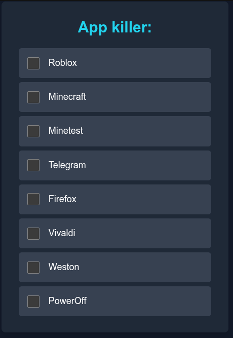

# Active Parental Control System "Kill Switch" for Linux

## [Deployed Example](https://killing-app-next.vercel.app)



## **User Guide**

**Parental Control for a Linux Server**

#### **1. What is this and how does it work?**

Forget about permissions. This system operates on the principle of **relentless monitoring and immediate response**.

Your web page is not a "permissions board," but a **"blacklist"** for unwanted applications. The server, in turn, becomes a vigilant guardian that checks every 5 seconds if the child has launched anything from this list.

1. **You (The Parent):** You decide which application needs to be terminated immediately.
2. **Web page with toggles:** This is your control panel for adding or removing applications from the "blacklist". When you enable a toggle, a flag file (e.g., `Telegram`) is created in the `/tmp/killing` folder.
3. **The Server (Cron Guardian):** Every 5 seconds, a special service on the server (`cron`) checks for the presence of these flag files. If it finds a flag (e.g., `/tmp/killing/Telegram`) and sees that the `Telegram` program itself is currently running, it **immediately and without warning closes it**.

This is a very powerful and uncompromising method of control.

#### **2. How to use it?**

1. **Open the control page:** Go to your address in a browser (e.g., `http://192.168.1.10:3000`).
2. **Use the toggles to manage the "blacklist":**
   - **ON (toggle is active):** The application is added to the "blacklist". If the child launches it, it will be **automatically closed within 5-10 seconds**.
   - **OFF (toggle is inactive):** The application is removed from the list. The child can use it without restrictions; the system will not interfere.

Changes are applied almost instantly.

#### **3. What does the child see and experience?**

This is a very important aspect. The child will encounter the following system behavior:

- They launch a game or program from the "blacklist".
- It appears on the screen for a few seconds; they might even see the main menu.
- Then the program **simply disappears**, as if it was never there. Without any error messages or warnings.

This can be confusing and frustrating. It is important to explain to the child that this is not a computer malfunction or a virus, but the parental control system at work.

#### **4. Important technical details and WARNINGS!**

This system is very powerful and must be used with an understanding of some key points.

1. **Killing by process name (`pkill`):** The system closes programs by finding them by their process name. This can have side effects!
   - **Example with Minecraft:** You've added `Minecraft` to the list. The system will execute the command `pkill java`. This means that **ANY program written in Java** running on the server will be immediately closed. If another important Java program is running on the server, it will be closed too. **Be careful!**

2. **The "PowerOff" button is an "Atomic Bomb"**:
   - The list includes a `PowerOff` option. This is not just a prohibition; it's a command for an **immediate emergency shutdown of the entire server**.
   - Use this option only in extreme cases when you need to shut everything down urgently. It is equivalent to pulling the power cord from the outlet — all unsaved data will be lost.

3. **Built-in vulnerabilities - never use this on a server open to the internet**:
   - Nothing prevents the child from learning to manage the system themselves - keep the address secret, and if necessary, simply change the connection port.
   - The presence of vulnerabilities gives the child a chance to surpass you in matters of internet security.
   - The ability to bypass the system is a way to avoid learned helplessness; encourage the child to develop, learn, and win!

4. **Double check for Telegram:** The script has two lines for Telegram (`pkill Telegram` and `pkill telegram`), as the process name can be in different cases depending on the installation source.
5. **Lack of flexibility:** The system does not allow for "permit for an hour". It operates in an "on/off" mode.

#### **5. Quick summary for the administrator**

- **Control element:** Flag files in the `/tmp/killing/` directory.
- **Executor:** System `cron`, running as `root` every minute.
- **Logic:** Within a one-minute interval, a loop runs that checks for the presence of a flag file 12 times with a 5-second pause and, if it exists, executes the `pkill` command for the corresponding process.
- **Web interface:** A Next.js application whose sole task is to create and delete flag files in `/tmp/killing/` at the parent's command.
- **Logging:** All `cron` actions are recorded in `/var/log/cron.log`, which is useful for debugging.

---

## **Installation and Configuration Guide**

#### **Introduction**

This guide describes the deployment of the parental control system, which consists of three key components:

1. **Web Interface (Next.js):** A control panel for the parent, allowing the creation and deletion of flag files.
2. **Cron Guardian (root cron):** A system script that frequently checks for flag files and forcibly terminates the corresponding processes.
3. **Initial State Script (user cron):** A script that creates default flag files when the server boots.

#### **Requirements**

Before you begin, ensure that your server (e.g., Ubuntu/Debian) has the following installed:

- Server access with `sudo` privileges.
- `git`
- `Node.js` (v18 or newer is recommended) and `npm`. The best way to install is via `nvm` (Node Version Manager).
- Different users created for the child and the parent (this guide uses `child` for the child and `mom` for the parent).

---

### **Step 1: Installing and Building the Web Interface (Next.js)**

This component is your "control panel".

1. **Clone the project repository:**

   ```bash
   git clone https:git@github.com:Val-d-emar/killing-app-next.git
   cd killing-app-next
   ```

2. **Install project dependencies:**

   ```bash
   npm install
   ```

3. **Configure environment variables:**
   Create a `.env.local` file for configuration.

   ```bash
   nano .env.local
   ```

   Paste a line into it with the list of applications you want to manage. The names must be **exact**, as they will be used for the flag file names.

   **`.env.local`**

   ```
   NEXT_PUBLIC_APP_LIST=Telegram,Minecraft,Firefox,Vivaldi,Minetest,Roblox,Weston,PowerOff
   ```

   Save and close the file (`Ctrl+X`, `Y`, `Enter`).

4. **Build the project for production:**
   You need to create an optimized version of the application to run on the server.

   ```bash
   npm run build
   ```

   This command will create a `.next` folder, ready to be launched.

### **Step 2: Configuring the Auto-start Service for the Web Interface (systemd)**

This service will ensure your "control panel" is always running and starts automatically.

1. **Create a systemd service file:**

   ```bash
   sudo nano /etc/systemd/system/killing-app-next.service
   ```

2. **Paste the following configuration into the file:**
   **Attention:** Replace `mom` with your username and `/home/mom/killing-app-next` with the full path to your project.

   ```ini
   [Unit]
   Description=Next.js Killing App Web UI
   After=network.target

   [Service]
   User=mom
   Group=mom
   WorkingDirectory=/home/mom/killing-app-next
   Environment=NODE_ENV=production

   # FIND THE CORRECT PATH! Execute 'which node' as the user 'mom'
   # and paste the result here.
   ExecStart=/home/mom/.nvm/versions/node/v22.20.0/bin/node /home/mom/killing-app-next/node_modules/.bin/next start

   Restart=always

   [Install]
   WantedBy=multi-user.target
   ```

3. **Start and enable the service:**

   ```bash
   sudo systemctl daemon-reload
   sudo systemctl start killing-app-next.service
   sudo systemctl enable killing-app-next.service
   ```

4. **Check the status and open the port:**

   ```bash
   sudo systemctl status killing-app-next.service
   # If the status is 'active (running)', everything is fine.

   # Open port 3000 in the firewall
   sudo ufw allow 3000
   ```

   Your web interface should now be accessible at `http://<server_IP>:3000`.

### **Step 3: Configuring the "Cron Guardian" (root cron)**

This is the main component — the "killer" of unwanted processes.

1. **Open the crontab for the `root` user:**

   ```bash
   sudo crontab -e
   ```

2. **Paste the block of tasks at the end of the file:**
   This block runs a loop every minute that checks for flag files 12 times (every 5 seconds) and terminates the corresponding processes.

   ```crontab
   # --- Killing App Cron Block ---
   SHELL=/bin/bash
   PATH=/usr/local/sbin:/usr/local/bin:/sbin:/bin:/usr/sbin:/usr/bin

   * * * * * ( for i in $(seq 0 11) ; do sleep 5 && ( if [ -f "/tmp/killing/Telegram" ] ; then pkill -f Telegram ; fi ) ; done ) >>/var/log/cron.log 2>&1
   * * * * * ( for i in $(seq 0 11) ; do sleep 5 && ( if [ -f "/tmp/killing/Telegram" ] ; then pkill -f telegram ; fi ) ; done ) >>/var/log/cron.log 2>&1
   * * * * * ( for i in $(seq 0 11) ; do sleep 5 && ( if [ -f "/tmp/killing/Minecraft" ] ; then pkill -f java ; fi ) ; done ) >>/var/log/cron.log 2>&1
   * * * * * ( for i in $(seq 0 11) ; do sleep 5 && ( if [ -f "/tmp/killing/Firefox" ] ; then pkill -f firefox ; fi ) ; done ) >>/var/log/cron.log 2>&1
   * * * * * ( for i in $(seq 0 11) ; do sleep 5 && ( if [ -f "/tmp/killing/Vivaldi" ] ; then pkill -f vivaldi ; fi ) ; done ) >>/var/log/cron.log 2>&1
   * * * * * ( for i in $(seq 0 11) ; do sleep 5 && ( if [ -f "/tmp/killing/Minetest" ] ; then pkill -f minetest ; fi ) ; done ) >>/var/log/cron.log 2>&1
   * * * * * ( for i in $(seq 0 11) ; do sleep 5 && ( if [ -f "/tmp/killing/Roblox" ] ; then pkill -f Roblox ; fi ) ; done ) >>/var/log/cron.log 2>&1
   * * * * * ( for i in $(seq 0 11) ; do sleep 5 && ( if [ -f "/tmp/killing/Weston" ] ; then pkill -f weston ; fi ) ; done ) >>/var/log/cron.log 2>&1
   * * * * * ( for i in $(seq 0 11) ; do sleep 5 && ( if [ -f "/tmp/killing/Roblox" ] ; then pkill -f sober ; fi ) ; done ) >>/var/log/cron.log 2>&1
   * * * * * ( for i in $(seq 0 11) ; do sleep 5 && ( if [ -f "/tmp/killing/PowerOff" ] ; then poweroff ; fi ) ; done ) >>/var/log/cron.log 2>&1
   # --- End Killing App Cron Block ---
   ```

3. **Save and close the file.** `cron` will automatically apply the changes.

### **Step 4: Configuring the Initial State (mom cron)**

This script ensures that default flag files are created when the server reboots (e.g., so that some applications are blocked immediately).

1. **Open the crontab for the `mom` user:**

   ```bash
   sudo -u mom crontab -e
   ```

2. **Add the `@reboot` line:**
   This command first ensures the `/tmp/killing` directory is created (since `/tmp` is cleared on reboot), and then creates flag files in it for applications that should be blocked by default.

   ```crontab
   # Create default flags on system boot
   @reboot /bin/mkdir -p /tmp/killing && /usr/bin/touch /tmp/killing/Minecraft /tmp/killing/Roblox
   ```

   In this example, `Minecraft` and `Roblox` will be blocked immediately after the server starts. You can add or remove any applications from this list.

3. **Save and close the file.**

### **Step 5: Configure user `mom` to perform passwordless shutdown**

   ```bash
   sudo echo "mom ALL=(ALL) NOPASSWD: /sbin/shutdown" > /etc/sudoers.d/mom-shutdown
   ```
### **Step 6: Final Check**

1. **Reboot the server:** `sudo reboot`.
2. **After booting, check:**
   - **Web Interface:** Is it accessible at `http://<server_IP>:3000`?
   - **Initial State:** Run `ls -l /tmp/killing`. You should see the `Minecraft` and `Roblox` files. The toggles for them on the web page should be enabled.
   - **"Cron Guardian" operation:** Log in to the server as the `child` user. Try to launch `firefox`. It should close within 5-10 seconds. Then, disable the `Firefox` flag on the web page and try launching it again — it should now work without problems.
   - **Logs:** Check `/var/log/cron.log` (or `sudo grep CRON /var/log/syslog`) to ensure the tasks are running.

**Setup is complete.** You now have a fully functional active application control system.

---

# Система Активного Родительского Контроля «Стоп-Кран» для Linux

## **Руководство пользователя**

**Родительский контроль для Linux сервера**

#### **1. Что это такое и как это работает?**

Забудьте о разрешениях. Эта система работает по принципу **неусыпного надзора и немедленного реагирования**.

Ваша веб-страница — это не "доска разрешений", а **"чёрный список"** для нежелательных приложений. Сервер, в свою очередь, превращается в неусыпного стража, который каждые 5 секунд проверяет, не запустил ли ребёнок что-то из этого списка.

1. **Вы (Родитель):** Вы решаете, какое приложение нужно немедленно прекращать.
2. **Веб-страница с переключателями:** Это ваш пульт для добавления или удаления приложений из "чёрного списка". Когда вы включаете переключатель, в папке `/tmp/killing` создается файл-метка (например, `Telegram`).
3. **Сервер (Крон-Страж):** Каждые 5 секунд специальная служба на сервере (`cron`) проверяет наличие этих файлов-меток. Если она находит метку (например, `/tmp/killing/Telegram`) и видит, что сама программа `Telegram` сейчас запущена, она **немедленно и без предупреждения закрывает её**.

Это очень мощный и бескомпромиссный метод контроля.

#### **2. Как этим пользоваться?**

1. **Откройте страницу управления:** Зайдите в браузере по вашему адресу (например, `http://192.168.1.10:3000`).
2. **Используйте переключатели для управления "чёрным списком":**
   - **ВКЛ (переключатель активен):** Приложение добавлено в "чёрный список". Если ребёнок его запустит, оно будет **автоматически закрыто в течение 5-10 секунд**.
   - **ВЫКЛ (переключатель неактивен):** Приложение удалено из списка. Ребёнок может им пользоваться без ограничений, система не будет его трогать.

Изменения применяются почти мгновенно.

#### **3. Что видит и чувствует ребёнок?**

Это очень важный аспект. Ребёнок столкнётся со следующим поведением системы:

- Он запускает игру или программу из "чёрного списка".
- Она появляется на экране на несколько секунд, возможно, он даже увидит главное меню.
- Затем программа **просто исчезает**, как будто ее и не было. Без каких-либо сообщений об ошибке или предупреждений.

Это может сбивать с толку и вызывать раздражение. Важно объяснить ребёнку, что это не поломка компьютера и не вирус, а работа системы родительского контроля.

#### **4. Важные технические детали и ПРЕДУПРЕЖДЕНИЯ!**

Эта система очень мощная, и её нужно использовать с пониманием некоторых ключевых моментов.

1. **"Убийство" по имени процесса (`pkill`):** Система закрывает программы, находя их по имени процесса. Это может иметь побочные эффекты!
   - **Пример с Minecraft:** Вы добавили в список `Minecraft`. Система будет выполнять команду `pkill java`. Это означает, что **ЛЮБАЯ программа, написанная на Java**, которая будет запущена на сервере, будет немедленно закрыта. Если на сервере работает какая-то другая важная программа на Java, она тоже будет закрыта. **Будьте осторожны!**

2. **Кнопка «PowerOff» — это "Атомная бомба"**:
   - В списке есть опция `PowerOff`. Это не просто запрет, это команда на **немедленное аварийное выключение всего сервера**.
   - Используйте эту опцию только в крайних случаях, когда нужно срочно всё выключить. Это эквивалентно выдергиванию шнура из розетки — все несохраненные данные будут потеряны.

3. **Заложенные уязвимости - никогда не используйте это на открытом сервере в сети интернет**:
   - Никто не мешает ребёнку самому научиться управлять системой - берегите адрес в секрете, если что - просто смените порт подключения.
   - Наличие уязвимостей даёт ребенку шанс превзойти Вас в вопросах интернет-безопасности.
   - Возможность обойти систему - способ избежать выученной беспомощности, поощряйте ребёнка развиваться, учиться и побеждать!

4. **Двойная проверка Telegram:** В скрипте есть две строки для Telegram (`pkill Telegram` и `pkill telegram`), так как имя процесса может быть в разном регистре в зависимости от источника установки.
5. **Отсутствие гибкости:** Система не позволяет "разрешить на час". Она работает в режиме "вкл/выкл".

#### **5. Краткое резюме для администратора**

- **Управляющий элемент:** Файлы-флаги в директории `/tmp/killing/`.
- **Исполнитель:** Системный `cron`, работающий от имени `root` каждую минуту.
- **Логика:** Внутри минутного интервала запускается цикл, который 12 раз с паузой в 5 секунд проверяет наличие файла-флага и, если он есть, выполняет команду `pkill` для соответствующего процесса.
- **Веб-интерфейс:** Приложение на Next.js, единственная задача которого — создавать и удалять файлы-флаги в `/tmp/killing/` по команде родителя.
- **Логирование:** Все действия `cron` записываются в `/var/log/cron.log`, что полезно для отладки.

---

## **Руководство по установке и настройке**

#### **Введение**

Эта инструкция описывает развертывание системы родительского контроля, состоящей из трех ключевых компонентов:

1. **Веб-интерфейс (Next.js):** Панель управления для родителя, позволяющая создавать и удалять файлы-флаги.
2. **Крон-Страж (root cron):** Системный скрипт, который с высокой частотой проверяет наличие файлов-флагов и принудительно завершает соответствующие процессы.
3. **Скрипт начального состояния (user cron):** Скрипт, который при загрузке сервера создает файлы-флаги по умолчанию.

#### **Требования**

Перед началом убедитесь, что на вашем сервере (например, Ubuntu/Debian) установлено следующее:

- Доступ к серверу с правами `sudo`.
- `git`
- `Node.js` (рекомендуется v18 или новее) и `npm`. Лучший способ установки — через `nvm` (Node Version Manager).
- Созданы разные пользователи для ребёнка и родителя (в этой инструкции используется имя ребенка `child` и родителя `mom`).

---

### **Шаг 1: Установка и сборка веб-интерфейса (Next.js)**

Этот компонент является вашим "пультом управления".

1. **Клонируйте репозиторий с проектом:**

   ```bash
   git clone https:git@github.com:Val-d-emar/killing-app-next.git
   cd killing-app-next
   ```

2. **Установите зависимости проекта:**

   ```bash
   npm install
   ```

3. **Настройте переменные окружения:**
   Создайте файл `.env.local` для конфигурации.

   ```bash
   nano .env.local
   ```

   Вставьте в него строку со списком приложений, которыми вы хотите управлять. Имена должны быть **точными**, так как они будут использоваться для имен файлов-флагов.

   **`.env.local`**

   ```
   NEXT_PUBLIC_APP_LIST=Telegram,Minecraft,Firefox,Vivaldi,Minetest,Roblox,Weston,PowerOff
   ```

   Сохраните и закройте файл (`Ctrl+X`, `Y`, `Enter`).

4. **Соберите проект для продакшена:**
   Необходимо создать оптимизированную версию приложения для запуска на сервере.

   ```bash
   npm run build
   ```

   Эта команда создаст папку `.next`, готовую к запуску.

### **Шаг 2: Настройка службы автозапуска для веб-интерфейса (systemd)**

Эта служба обеспечит постоянную работу и автоматический запуск вашего "пульта управления".

1. **Создайте файл службы systemd:**

   ```bash
   sudo nano /etc/systemd/system/killing-app-next.service
   ```

2. **Вставьте в файл следующую конфигурацию:**
   **Внимание:** Замените `mom` на имя вашего пользователя и `/home/mom/killing-app-next` на полный путь к вашему проекту.

   ```ini
   [Unit]
   Description=Next.js Killing App Web UI
   After=network.target

   [Service]
   User=mom
   Group=mom
   WorkingDirectory=/home/mom/killing-app-next
   Environment=NODE_ENV=production

   # НАЙДИТЕ ПРАВИЛЬНЫЙ ПУТЬ! Выполните 'which node' от имени пользователя mom
   # и вставьте результат сюда.
   ExecStart=/home/mom/.nvm/versions/node/v22.20.0/bin/node /home/mom/killing-app-next/node_modules/.bin/next start

   Restart=always

   [Install]
   WantedBy=multi-user.target
   ```

3. **Запустите и включите службу:**

   ```bash
   sudo systemctl daemon-reload
   sudo systemctl start killing-app-next.service
   sudo systemctl enable killing-app-next.service
   ```

4. **Проверьте статус и откройте порт:**

   ```bash
   sudo systemctl status killing-app-next.service
   # Если статус 'active (running)', то все хорошо.

   # Откройте порт 3000 в файрволе
   sudo ufw allow 3000
   ```

   Теперь ваш веб-интерфейс должен быть доступен по адресу `http://<IP_сервера>:3000`.

### **Шаг 3: Настройка "Крон-Стража" (root cron)**

Это самый главный компонент — "убийца" нежелательных процессов.

1. **Откройте crontab для пользователя `root`:**

   ```bash
   sudo crontab -e
   ```

2. **Вставьте в конец файла блок с задачами:**
   Этот блок запускает каждую минуту цикл, который 12 раз (каждые 5 секунд) проверяет наличие файлов-флагов и завершает соответствующие процессы.

   ```crontab
   # --- Killing App Cron Block ---
   SHELL=/bin/bash
   PATH=/usr/local/sbin:/usr/local/bin:/sbin:/bin:/usr/sbin:/usr/bin

   * * * * * ( for i in $(seq 0 11) ; do sleep 5 && ( if [ -f "/tmp/killing/Telegram" ] ; then pkill -f Telegram ; fi ) ; done ) >>/var/log/cron.log 2>&1
   * * * * * ( for i in $(seq 0 11) ; do sleep 5 && ( if [ -f "/tmp/killing/Telegram" ] ; then pkill -f telegram ; fi ) ; done ) >>/var/log/cron.log 2>&1
   * * * * * ( for i in $(seq 0 11) ; do sleep 5 && ( if [ -f "/tmp/killing/Minecraft" ] ; then pkill -f java ; fi ) ; done ) >>/var/log/cron.log 2>&1
   * * * * * ( for i in $(seq 0 11) ; do sleep 5 && ( if [ -f "/tmp/killing/Firefox" ] ; then pkill -f firefox ; fi ) ; done ) >>/var/log/cron.log 2>&1
   * * * * * ( for i in $(seq 0 11) ; do sleep 5 && ( if [ -f "/tmp/killing/Vivaldi" ] ; then pkill -f vivaldi ; fi ) ; done ) >>/var/log/cron.log 2>&1
   * * * * * ( for i in $(seq 0 11) ; do sleep 5 && ( if [ -f "/tmp/killing/Minetest" ] ; then pkill -f minetest ; fi ) ; done ) >>/var/log/cron.log 2>&1
   * * * * * ( for i in $(seq 0 11) ; do sleep 5 && ( if [ -f "/tmp/killing/Roblox" ] ; then pkill -f Roblox ; fi ) ; done ) >>/var/log/cron.log 2>&1
   * * * * * ( for i in $(seq 0 11) ; do sleep 5 && ( if [ -f "/tmp/killing/Weston" ] ; then pkill -f weston ; fi ) ; done ) >>/var/log/cron.log 2>&1
   * * * * * ( for i in $(seq 0 11) ; do sleep 5 && ( if [ -f "/tmp/killing/Roblox" ] ; then pkill -f sober ; fi ) ; done ) >>/var/log/cron.log 2>&1
   * * * * * ( for i in $(seq 0 11) ; do sleep 5 && ( if [ -f "/tmp/killing/PowerOff" ] ; then poweroff ; fi ) ; done ) >>/var/log/cron.log 2>&1
   # --- End Killing App Cron Block ---
   ```

3. **Сохраните и закройте файл.** `cron` автоматически применит изменения.

### **Шаг 4: Настройка начального состояния (mom cron)**

Этот скрипт гарантирует, что при перезагрузке сервера будут созданы файлы-флаги по умолчанию (например, чтобы какие-то приложения были сразу заблокированы).

1. **Откройте crontab для пользователя `mom`:**

   ```bash
   sudo -u mom crontab -e
   ```

2. **Добавьте строку `@reboot`:**
   Эта команда сначала гарантированно создает директорию `/tmp/killing` (так как `/tmp` очищается при перезагрузке), а затем создает в ней файлы-флаги для приложений, которые должны быть заблокированы по умолчанию.

   ```crontab
   # Создать флаги по умолчанию при загрузке системы
   @reboot /bin/mkdir -p /tmp/killing && /usr/bin/touch /tmp/killing/Minecraft /tmp/killing/Roblox
   ```

   В этом примере `Minecraft` и `Roblox` будут заблокированы сразу после старта сервера. Вы можете добавить или убрать любые приложения из этого списка.

3. **Сохраните и закройте файл.**

### **Шаг 5: Настройка пользователю mom права выполнять shutdown без пароля**

   ```bash
   sudo echo "mom ALL=(ALL) NOPASSWD: /sbin/shutdown" > /etc/sudoers.d/mom-shutdown
   ```

### **Шаг 6: Финальная проверка**

1. **Перезагрузите сервер:** `sudo reboot`.
2. **После загрузки проверьте:**
   - **Веб-интерфейс:** Доступен ли он по адресу `http://<IP_сервера>:3000`?
   - **Начальное состояние:** Выполните `ls -l /tmp/killing`. Вы должны увидеть файлы `Minecraft` и `Roblox`. Переключатели для них на веб-странице должны быть включены.
   - **Работу "Крон-Стража":** Зайдите на сервер под пользователем `child`. Попробуйте запустить `firefox`. В течение 5-10 секунд он должен закрыться. Затем выключите флаг `Firefox` на веб-странице и попробуйте запустить его снова — теперь он должен работать без проблем.
   - **Логи:** Проверьте `/var/log/cron.log` (или `sudo grep CRON /var/log/syslog`), чтобы убедиться, что задачи выполняются.

**Настройка завершена.** Теперь у вас есть полностью рабочая система активного контроля приложений.
